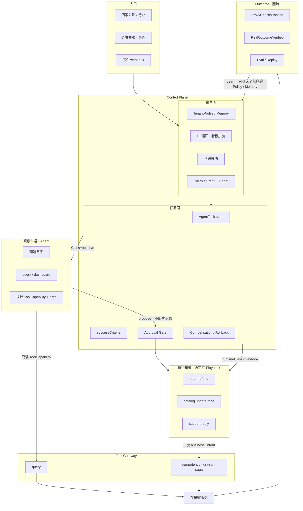
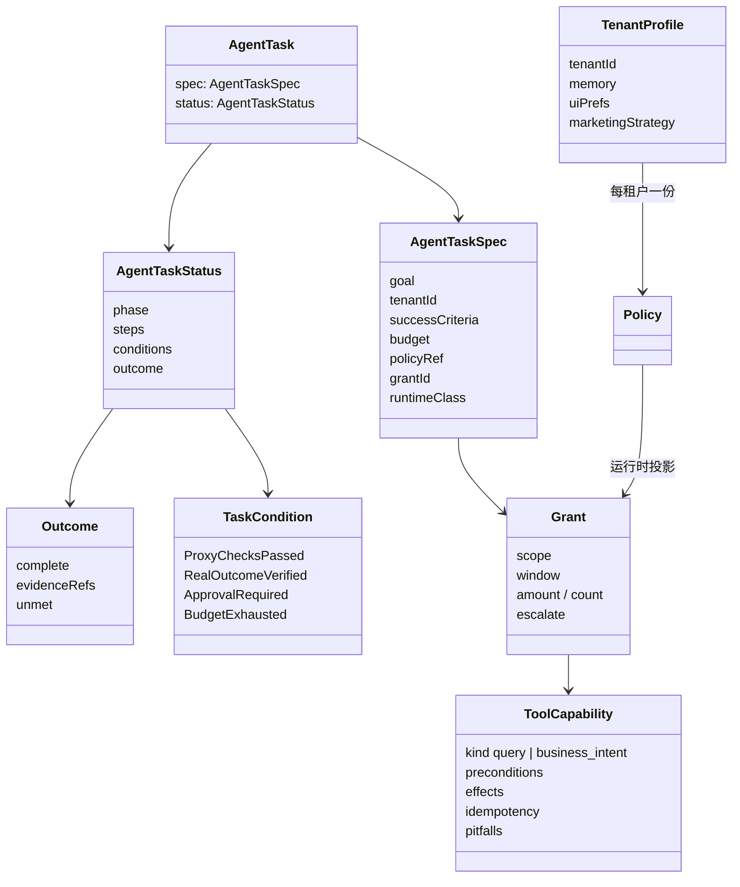
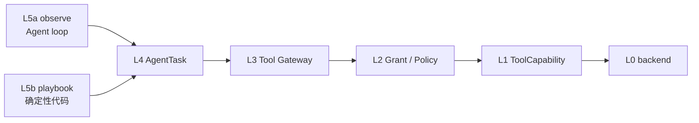
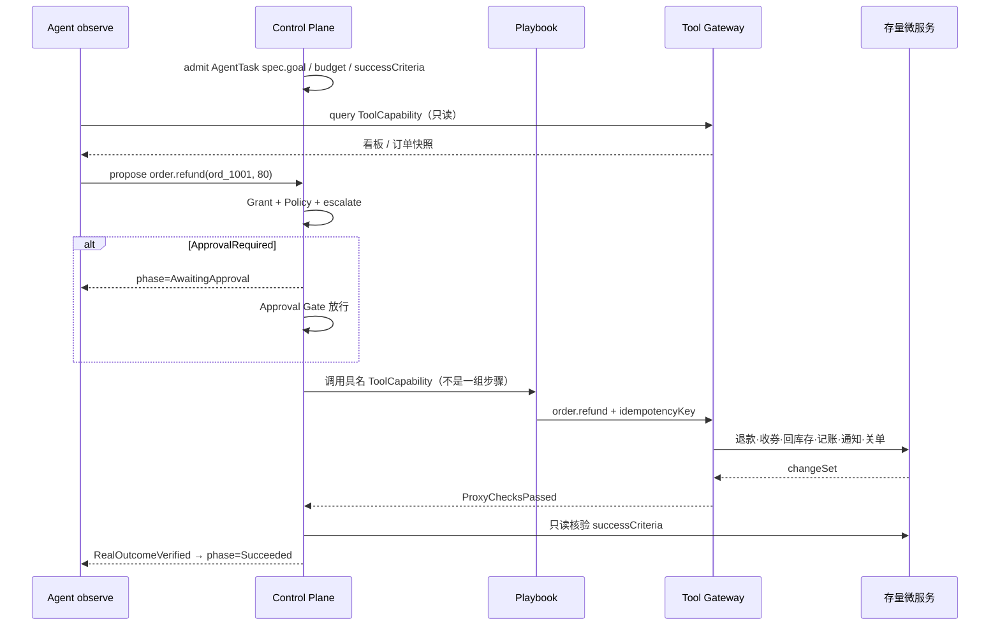

# IdealAgent

两块：编码侧直接跑官方 [Pi](https://github.com/earendil-works/pi) harness；SaaS 侧做 **agent 基础设施**——把商业动作做成任意 agent 都能安全执行的原语。

```
IdealAgent
  ├─ CLI / createIdealAgent()  →  @earendil-works/pi-coding-agent
  └─ src/platform/             →  grant · 能力网关 · AgentTask · Outcome
```

循环、TUI、会话是 Pi 的。平台侧不把写路径交给模型临场规划。

## Agent 基础设施

控制面（Control Plane）管的是 **AgentTask 如何被承认、约束、收敛**，不管模型怎么说话。核心写逻辑（钱、库存、券、通知、状态机）不交给大模型临场规划：模型走观察车道（读、看板、诊断），写路径只能点名一个已经闭合的 **ToolCapability / Playbook**。两边共用同一套 Grant、Policy、Approval Gate 和 Outcome。



核心履约流程固定：退款、支付、库存、账务还是那几条 Playbook。千人千面落在两处——**UI**（看板、话术、呈现）和 **营销策略**（推什么、推给谁、怎么叠加）。`marketing.createCoupon` 的核销与账务步骤全站一份；「这周做老客满减还是新客折扣」是该租户的策略，由观察车道提议，再点名同一个 Playbook。

两车道不对等：agent 可以查、可以建议，不能自己拼「先退款再收券再记账」。那六步写死在 `order.refund` 这个 ToolCapability 里。

| 车道 | runtimeClass | 谁规划 | 典型能力 | 失败代价 |
|---|---|---|---|---|
| 观察 | `observe` | Agent loop（Pi / 小模型） | 订单查询、售后看板、活动诊断、话术草稿 | 看错了，重查即可 |
| 执行 | `playbook` | 确定性系统代码，模型不在环内 | 退款、改价、关单、发券、冲账 | 钱出去了，撤不回 |

护城河是 ToolCapability 契约和执行保证，不是 prompt。八个业务域是工具目录的命名空间，不是并行打分员。

### Control Plane 对象

对齐「目标收敛」而不是「过程编排」。AgentTask 是一等对象，Outcome 是终态，Condition 是可观察的收敛信号。



| 术语 | 含义 |
|---|---|
| **AgentTask** | 一次被承认的目标：`spec` 写意图与约束，`status` 写收敛进度。 |
| **successCriteria** | 成功判据。只读外部状态，物理上拿不到 agent 自述。 |
| **Budget** | 步数、金额、次数。agent 循环也刷不穿，由网关强制。 |
| **TenantProfile / Memory** | 该租户的 UI 偏好、营销策略、话术和被接受过的 Outcome。核心履约 Playbook 不写在这里。 |
| **Policy / Grant** | Policy 是**该租户**的规则，不是平台统一流程；Grant 是按任务签发的、会过期的授权。 |
| **Approval Gate** | 不可逆写或命中 `escalate` 时卡住，`phase=AwaitingApproval`。 |
| **ToolCapability** | 给自治执行体看的契约，不是 OpenAPI schema。写能力粒度是一个商业意图。 |
| **ProxyChecksPassed** | 过程绿灯：调用没被拒、剧本跑完。**不是完成。** |
| **RealOutcomeVerified** | 外部世界已满足 successCriteria（账本、订单、券）。没有它，`complete` 不能为 true。 |
| **Outcome** | `{ complete, evidenceRefs, unmet }`。飞轮入口：决策与事后结果配对。 |
| **phase** | `Pending → Running → AwaitingApproval / Succeeded / Failed / Blocked`。 |

| 命名空间 | 商业意图（示例） |
|---|---|
| `store` | 店铺配置、装修、员工权限 |
| `catalog` | 商品、SKU、库存、定价 |
| `order` | 履约、退款（一次调用编排多步存量 API） |
| `crm` | 会员、积分、客户分层 |
| `marketing` | 优惠券、满减、活动叠加 |
| `support` | 咨询、话术、工单 |
| `finance` | 支付、对账、结算 |
| `risk` | 合规与异常 |

### 代码分层

`src/platform/` 按依赖单向向下切，`npm run check:layers` 强制这条边。只有 `platform.ts` 知道所有层。



| 层 | 目录 | 职责 |
|---|---|---|
| L0 | `backend/` | 细粒度存量接口。agent 永远不直接碰。 |
| L1 | `capability/` | ToolCapability 注册表。`query` 给观察车道；`business_intent` 是写死的 Playbook。 |
| L2 | `grant/` | Policy 的运行时投影：scope、window、Budget、escalate。 |
| L3 | `gateway/` | Tool Gateway：idempotency、dry-run、saga、审计。写能力不带幂等键直接拒绝。 |
| L4 | `task/` | AgentTask 控制面。`settle()` 写 Condition 和 Outcome，不信调用记录。 |
| L5a | `runtime/` | `runtimeClass=observe`：读、看板、诊断、propose。 |
| L5b | `runtime/` | `runtimeClass=playbook`：被 Approval Gate 放行后执行，模型不在环内。 |

三条环分开转：Execute（秒–分钟，跑 AgentTask）→ Eval（小时–天，回放与对照）→ Learn（天–周，回写**该租户**的 UI 偏好 / 营销策略 / Grant 额度）。不要把 Learn 塞进 Execute，也不要把「这周卖得动」学成全站一份标准营销流程。

### 千人千面落在哪

核心流程固定，可变的是壳和策略。UI 和营销策略走观察车道 + TenantProfile；履约、资金、库存仍走确定性 Playbook。

| | 固定（平台一份） | 千人千面（每租户一份） |
|---|---|---|
| 是什么 | 核心履约 Playbook、Tool Gateway 保证 | UI 拼装、话术、看板；营销策略（推谁、推什么、怎么叠加） |
| 例子 | `order.refund` 永远六步；发券核销与冲账同一套 | A 店看板只看售后积压；B 店首页是活动诊断；C 店策略是老客满减，D 店是新客折扣 |
| 谁规划 | 确定性系统代码 | Agent observe + TenantProfile |
| 谁执行 | 同一条 Playbook | 仍点名标准 ToolCapability（如 `marketing.createCoupon`），不现场编核销步骤 |
| 不能变成 | 每家一套退款/账务代码 | 全站一份「标准装修 / 标准大促方案」 |

### 一次写操作（模型不编排步骤）



```bash
npm run platform:demo
npm run check:layers
```

```ts
import { platform } from "idealagent";

const app = new platform.Platform({ backend: platform.seedCommerce("shop-1") });
const grant = app.issueGrant({
  tenantId: "shop-1",
  agent: "ops-assistant",
  scope: ["order.*"],
  constraints: { amount: { currency: "CNY", perCall: 200, total: 500 } },
  escalate: ["amount > 100"],
});

const task = await app.runTask({
  taskId: "task_001",
  tenantId: "shop-1",
  goal: "为 ord_1001 办理全额退款",
  grantId: grant.grantId,
  successCriteria: [
    platform.checks.orderRefundedAtLeast("ord_1001", 80),
    platform.checks.ledgerHasRefund("ord_1001", 80),
  ],
  runtime: platform.scriptedRuntime([
    { capability: "order.query", args: { orderId: "ord_1001" } },
    {
      capability: "order.refund",
      args: { orderId: "ord_1001", amount: 80 },
      options: { idempotencyKey: "k" },
    },
  ]),
});
```

`src/saas/` 是更早的事件打分骨架（Gateway → 并行 specialist → Fusion → Critic），保留作对照，不再是主路径。

## 编码 Agent（Pi）

需要 Node.js **>= 22.19**。

```bash
cp .env.example .env
npm install
npm run build
```

`.env` 里任选一个：`DASHSCOPE_API_KEY` / `DEEPSEEK_API_KEY` / `OPENAI_API_KEY`。

```bash
npx idealagent
npx idealagent -p "看看这个仓库"
```

配置在 `~/.idealagent`（models.json / settings.json）。`createIdealAgent()` 内部调用 Pi 的 `createAgentSession()`。
